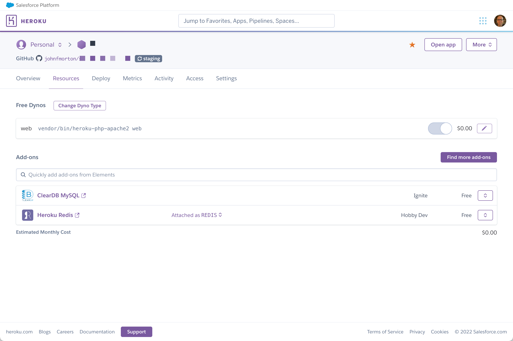
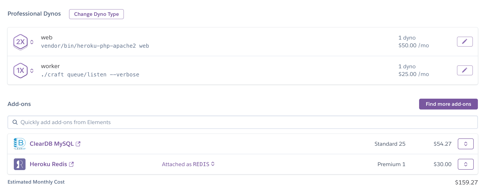
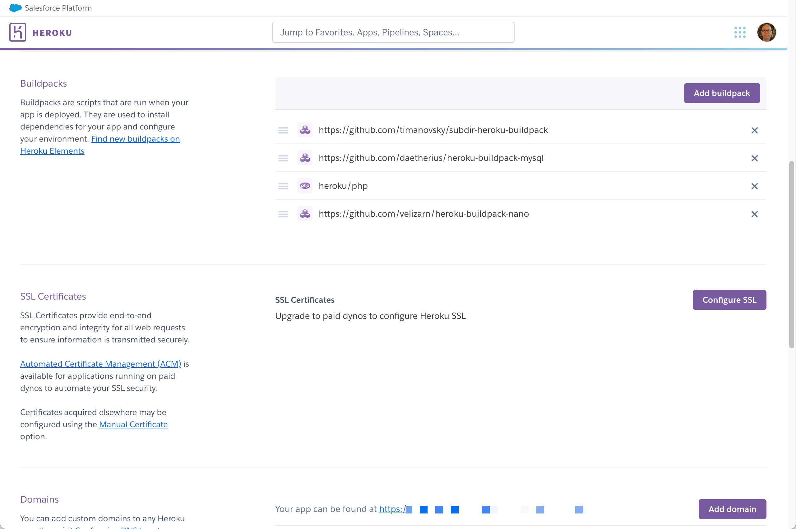

# A Heroku-specific version of Craft CMS starter

This repo is a version of the nystudio107/craft vite branch, https://github.com/nystudio107/craft/tree/craft-vite/cms, updated to work with Heroku.

## The alterations

This scaffolding, which you can read about in details after this intro, uses Docker for local development. The Craft CMS installation lives in the `cms` directory when in local development.

The original Craft starter has Redis support built in. It does not expect a password for Redis. When using Heroku, it does expect a password. Heroku Redis uses a `REDIS_URL` Config Var to configure Redis so we use that same format to configure the local development version of Redis.

For example, this is a sample of the format of the `REDIS_URL` that Heroku will provide.

```
REDIS_URL=redis://:thepassword@ec2-1-234-56-78.compute-1.amazonaws.com:12345
```

You can see `thepassword` portion is the password. The `ec2-1-234-56-78.compute-1.amazonaws.com` is the host. The `12345` is the port.

For local development, we set the Redis in the Docker set up, we use this

```
REDIS_URL=redis://:@redis:6379
```

There is not password. The host is `redis`, which is how it is referenced insideo the Docker network of containers, i.e. it's not `localhost` in our local development environment.

## Heroku resources and buildpacks

### There are 2 buildpacks expected with this repo.

You must manually add these buildpacks.

1. ClearDB MySQL
2. Heroku Redis



In the screenshot above, notice that this is the "Hobby Dev" version of Heroku Redis. This version does not require an SSL connection. After updating the app to be paid level, it will require an SSL connection. See [Con­fig­ur­ing Craft CMS with Redis for use on Heroku](https://supergeekery.com/blog/heroku-redis-sll-configuration) for details.

### Setting up the worker

In the Profile, there is a worker defined.



In the screenshot above notice that the *workeer* is an additional dyno that needs to be upgraded. This worker will run the queue for the site and this is why the env variable, `RUN_QUEUE_AUTOMATICALLY`, is set to false.

### There are 4 buildpacks that need to be in the following order.

1. https://github.com/timanovsky/subdir-heroku-buildpack
2. https://github.com/daetherius/heroku-buildpack-mysql
3. heroku/php
4. https://github.com/velizarn/heroku-buildpack-nano

The `heroku/php` will be automatically added when you initially deploy the project to Heroku. The other three are manually added. You will need to adjust the order of them.

For the `subdir-heroku-buildpack` to work, you must create a Config Var of `PROJECT_PATH` that is set to `cms`.



## How to log in

username:
```
morton+heroku-admin@jmx2.com
```

password:
```
password
```

## Original documentation

What follows is the original README.md from [https://github.com/nystudio107/craft/tree/craft-vite/cms](https://github.com/nystudio107/craft/tree/craft-vite/cms).

---


<p align="center"><a href="https://craftcms.com/" target="_blank"></a></p>

## About nystudio107/craft

This is an alternate scaffolding package for Craft 3 CMS projects to Pixel & Tonic's canonical [craftcms/craft](https://github.com/craftcms/craft) package.

### Vite buildchain

This project uses a [Vite.js](https://vitejs.dev/) for the build system as per [Vite.js Next Generation Frontend Tooling + Craft CMS](https://nystudio107.com/blog/using-vite-js-next-generation-frontend-tooling-with-craft-cms), as opposed to the usual webpack buildchain.

Vite is _fast_ ⚡

### The project

The project is based on [Craft CMS](https://CraftCMS.com) using a unique `templates/_boilerplate` system for web/AJAX/AMP pages, and implements a number of technologies/techniques:

* [Docker](https://www.docker.com/) Docker is used for local development; see **Setting Up Local Dev** below for details
* A base Twig templating setup as described in [An Effective Twig Base Templating Setup](https://nystudio107.com/blog/an-effective-twig-base-templating-setup)
* [Vite.js](https://vitejs.dev/) is used for the build system as per [Vite.js Next Generation Frontend Tooling + Craft CMS](https://nystudio107.com/blog/using-vite-js-next-generation-frontend-tooling-with-craft-cms)
* [TypeScript](https://www.typescriptlang.org/) for strictly typed JavaScript code
* [Vue.js 3.0](https://vuejs.org/) is used for some of the interactive bits on the website, and Vue.js 3.x allows us to leverage the [Composition API](https://composition-api.vuejs.org/)
* [Tailwind CSS](https://tailwindcss.com/) for the site-wide CSS using the [@tailwindcss/jit](https://blog.tailwindcss.com/just-in-time-the-next-generation-of-tailwind-css)
* JSON-LD structured data as per [Annotated JSON-LD Structured Data Examples](https://nystudio107.com/blog/annotated-json-ld-structured-data-examples)
* [Google AMP](https://developers.google.com/amp/) versions of the podcast episode and other pages
* Image transforms are done via a [Serverless Image Handler](https://aws.amazon.com/solutions/serverless-image-handler/) lambda function, as described in the [Setting Up Your Own Image Transform Service](https://nystudio107.com/blog/setting-up-your-own-image-transform-service) article
* Static assets are stored in AWS S3 buckets with CloudFront as the CDN, as per the [Setting Up AWS S3 Buckets + CloudFront CDN for your Assets](https://nystudio107.com/blog/using-aws-s3-buckets-cloudfront-distribution-with-craft-cms) article
* Implements a Service Worker via Google's [Workbox](https://developers.google.com/web/tools/workbox/) as per [Service Workers and Offline Browsing](https://nystudio107.com/blog/service-workers-and-offline-browsing)
* Critical CSS as per [Implementing Critical CSS on your website](https://nystudio107.com/blog/implementing-critical-css) using the [rollup-plugin-critical](https://github.com/nystudio107/rollup-plugin-critical)
* Frontend error handling as per [Handling Errors Gracefully in Craft CMS](https://nystudio107.com/blog/handling-errors-gracefully-in-craft-cms)
* A custom site module as per [Enhancing a Craft CMS 3 Website with a Custom Module](https://nystudio107.com/blog/enhancing-a-craft-cms-3-website-with-a-custom-module)
* CLI-based queue as per [Robust queue job handling in Craft CMS](https://nystudio107.com/blog/robust-queue-job-handling-in-craft-cms)
* FastCGI Static Cache as per [Static Page Caching with Craft CMS](https://nystudio107.com/blog/static-caching-with-craft-cms)
* [buddy.works](http://buddy.works/) atomic deployments

...and probably a bunch of other stuff too.

The following Craft CMS plugins are used on this site:
* [FastCGI Cache Bust](https://nystudio107.com/plugins/fastcgi-cache-bust) - to bust the FastCGI cache whenever entries are modified
* [ImageOptimize](https://nystudio107.com/plugins/imageoptimize) - for the optimized images and `srcset`s used on the site
* [Minify](https://nystudio107.com/plugins/minify) - to minify the HTML and inline JS/CSS
* [Retour](https://nystudio107.com/plugins/retour) - for setting up 404 redirects
* [SEOmatic](https://nystudio107.com/plugins/seomatic) - for handling site-side SEO
* [Vite](https://nystudio107.com/plugins/vite) - for loading Vite-generated `manifest.json` resources in a modern way
* [Typogrify](https://nystudio107.com/plugins/typogrify) - for smart quotes and other typographic ligatures
* [Webperf](https://nystudio107.com/plugins/webperf) - for monitoring web performance

You can read more about it in the [Setting up a New Craft 3 CMS Project](https://nystudio107.com/blog/setting-up-a-craft-cms-3-project) article.

## Using nystudio107/craft

This project package works exactly the way Pixel & Tonic's [craftcms/craft](https://github.com/craftcms/craft) package works; you create a new project by first creating & installing the project:

    composer create-project nystudio107/craft:dev-craft-vite PATH --no-install

Make sure that `PATH` is the path to your project, including the name you want for the project, e.g.:

    composer create-project nystudio107/craft:dev-craft-vite vitecraft --no-install --remove-vcs

We use `--no-install` so that the composer packages for the root project are not installed.

## Setting Up Local Dev

You'll need Docker desktop for your platform installed to run the project in local development

* Start up the site by typing `make dev` in terminal in the project's root directory (the first build will be somewhat lengthy)
* Navigate to `http://localhost:8000` to use the site; the `vite-dev-server` runs off of `http://localhost:3000`

Wait until you see the following to indicate that the PHP container is ready:

```
php_1         | Craft is installed.
php_1         | Applying changes from your project config files ... done
php_1         | [01-Dec-2020 18:38:46] NOTICE: fpm is running, pid 22
php_1         | [01-Dec-2020 18:38:46] NOTICE: ready to handle connections
```

...and the following to indicate that the Vite container is ready:
```
vite_1        |   vite v2.3.2 dev server running at:
vite_1        |
vite_1        |   > Local:    http://localhost:3000/
vite_1        |   > Network:  http://172.22.0.5:3000/
vite_1        |
vite_1        |   ready in 1573ms.
```

The CP login credentials are initially set as follows:

Login: `andrew@nystudio107.com` \
Password: `letmein`

Obviously change these to whatever you like as needed.

Build the production assets by typing `make build` to build the critical CSS, fonts, and other production assets. They will appear in `cms/web/dist/` (just double-click on the `report-legacy.html` and `report-modern.html` files to view them).

**N.B.:** Without authorization & credentials (which are private), the `make pulldb` will not work (it just runs `scripts/docker_pull_db.sh`). It's provided here for instructional purposes.

## Makefile Project Commands

This project uses Docker to shrink-wrap the devops it needs to run around the project.

To make using it easier, we're using a Makefile and the built-in `make` utility to create local aliases. You can run the following from terminal in the project directory:

- `make dev` - starts up the local dev server listening on `http://localhost:8000/`
- `make build` - builds the static assets via the Vite buildchain
- `make clean` - shuts down the Docker containers, removes any mounted volumes (including the database), and then rebuilds the containers from scratch
- `make update` - causes the project to update to the latest Composer and NPM dependencies
- `make update-clean` - completely removes `node_modules/` & `vendor/`, then causes the project to update to the latest Composer and NPM dependencies
- `make composer xxx` - runs the `composer` command passed in, e.g. `make composer install`
- `make craft xxx` - runs the `craft` [console command](https://craftcms.com/docs/3.x/console-commands.html) passed in, e.g. `make craft project-config/apply` in the php container
- `make npm xxx` - runs the `npm` command passed in, e.g. `make npm install`
- `make pulldb` - runs the `scripts/docker_pull_db.sh` script to pull a remote database into the database container; the `scripts/.env.sh` must be set up first
- `make restoredb xxx` - runs the `scripts/docker_restore_db.sh` script to restore a local database dump into the database container; the `scripts/.env.sh` must be set up first

### Other notes

To update to the latest Composer packages (as constrained by the `cms/composer.json` semvers) and latest npm packages (as constrained by the `buildchain/package.json` semvers), do:
```
make update
```

To start from scratch by removing `buildchain/node_modules/` & `cms/vendor/`, then update to the latest Composer packages (as constrained by the `cms/composer.json` semvers) and latest npm packages (as constrained by the `buildchain/package.json` semvers), do:
```
make update-clean
```

To use Xdebug with VSCode install the [PHP Debug extension](https://marketplace.visualstudio.com/items?itemName=felixfbecker.php-debug ) and use the following configuration in your `.vscode/launch.json`:
```json
{
    "version": "0.2.0",
    "configurations": [
        {
            "name": "Listen for Xdebug",
            "type": "php",
            "request": "launch",
            "port": 9003,
            "log": true,
            "externalConsole": false,
            "pathMappings": {
                "/var/www/project/cms": "${workspaceRoot}/cms"
            },
            "ignore": ["**/vendor/**/*.php"]
        }
    ]
}
```


Below is the entire intact, unmodified `README.md` from Pixel & Tonic's [craftcms/craft](https://github.com/craftcms/craft):

## Roadmap

* Update to Tailwind CSS `^3.0.0`

.....

<p align="center"><a href="https://craftcms.com/" target="_blank"></a></p>

## About Craft CMS

Craft is a flexible and scalable CMS for creating bespoke digital experiences on the web and beyond.

It features:

- An intuitive Control Panel for administration tasks and content creation.
- A clean-slate approach to content modeling and [front-end development](https://docs.craftcms.com/v3/dev/).
- A built-in Plugin Store with hundreds of free and commercial [plugins](https://plugins.craftcms.com/).
- A robust framework for [module and plugin development](https://docs.craftcms.com/v3/extend/).

Learn more about it at [craftcms.com](https://craftcms.com).

## Tech Specs

Craft is written in PHP (7+), and built on the [Yii 2 framework](https://www.yiiframework.com/). It can connect to MySQL (5.5+) and PostgreSQL (9.5+) for content storage.

## Installation

See the following documentation pages for help installing Craft 3:

- [Server Requirements](https://docs.craftcms.com/v3/requirements.html)
- [Installation Instructions](https://docs.craftcms.com/v3/installation.html)
- [Upgrading from Craft 2](https://docs.craftcms.com/v3/upgrade.html)

## Popular Resources

- **[Documentation](http://docs.craftcms.com/v3/)** – Read the official docs.
- **[Guides](https://craftcms.com/guides)** – Follow along with the official guides.
- **[#craftcms](https://twitter.com/hashtag/craftcms)** – See the latest tweets about Craft.
- **[Discord](https://craftcms.com/discord)** – Meet the community.
- **[Stack Exchange](http://craftcms.stackexchange.com/)** – Get help and help others.
- **[CraftQuest](https://craftquest.io/)** – Watch unlimited video lessons and courses.
- **[Craft Link List](http://craftlinklist.com/)** – Stay in-the-know.
- **[nystudio107 Blog](https://nystudio107.com/blog)** – Learn Craft and modern web development.
